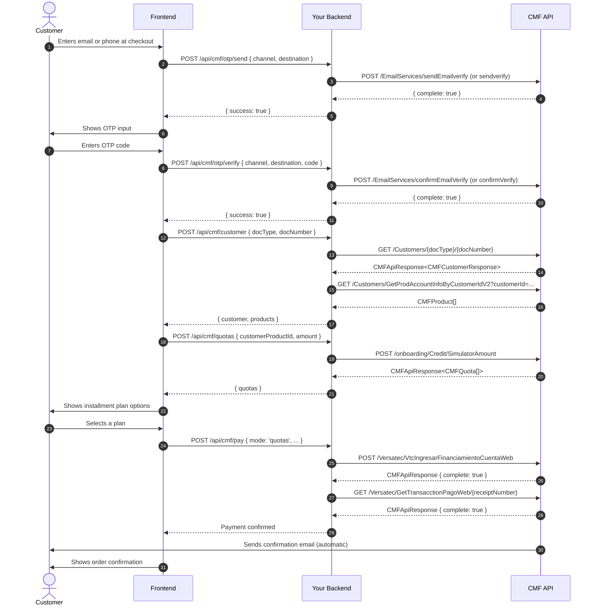
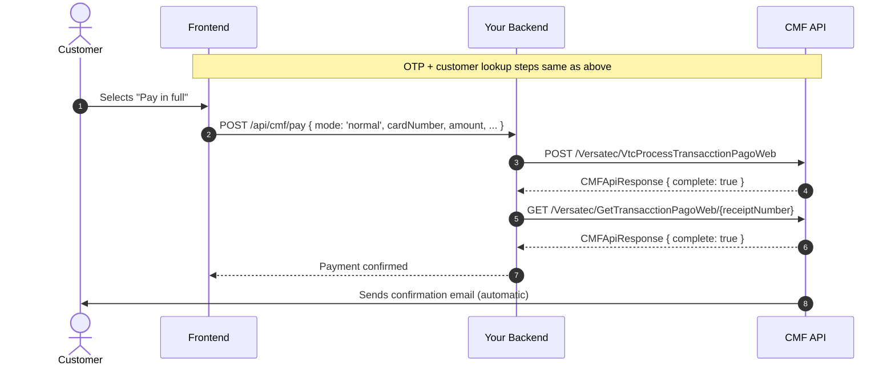
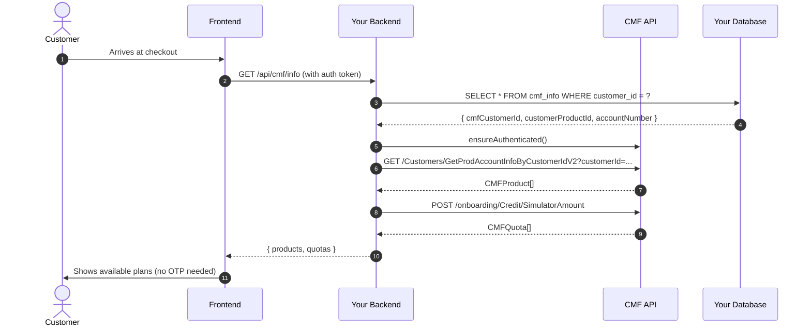

# CMF Payment Flow

## Overview

The CMF payment flow has two paths: **installment (quota) purchase** and **normal (full charge) purchase**. Both paths require authentication and customer lookup. The installment path adds a quota simulation step.

A one-time OTP verification is required when a customer links their CMF account for the first time. After linking, store the `cmfCustomerId` in your database to skip OTP on future checkouts.

---

## Installment Purchase Flow



---

## Normal (Full Charge) Purchase Flow



---

## Returning Customer Flow (Stored CMF Info)

If you store `cmfCustomerId` and `customerProductId` in your database after the first OTP verification, you can skip the OTP and customer search on future checkouts:



---

## Error Handling

| Scenario | HTTP status | `complete` | Action |
|---|---|---|---|
| Customer not found | 404 from CMF | N/A | Ask customer to verify their document |
| Invalid OTP code | 200 from CMF | `false` | Show error, allow retry (max 3 attempts for phone) |
| OTP expired | 200 from CMF | `false` | Ask customer to request a new code |
| Phone OTP blocked | 200 from CMF | `false` | Advise customer to contact Banco General |
| Insufficient funds | 200 from CMF | `false` | code: 2006 — show user-friendly message |
| Invalid amount | 200 from CMF | `false` | code: 1000 — validate amount before sending |
| Network timeout | Axios error | N/A | Retry with exponential backoff (max 3 retries) |

**Key rule**: HTTP 200 from CMF does not mean success. Always check `complete === true` before proceeding. The `CMFClient` methods throw on `complete === false`, so a `try/catch` is sufficient.

---

## State Machine (Frontend)

The OTP + customer search portion of the flow follows this state machine:

```
idle
  └─► [user enters email/phone] ─► sendOtp() ─► verifying
        └─► [user enters code] ─► verifyOtp() ─► done
              └─► [error] ─► retry (max 3 for phone)
```

Use the `useCMFOtp` hook, which manages this state internally via the `step` property:
- `step === 'idle'` — Show email/phone input
- `step === 'verify'` — Show OTP code input
- `step === 'done'` — OTP verified; proceed to product/quota selection
